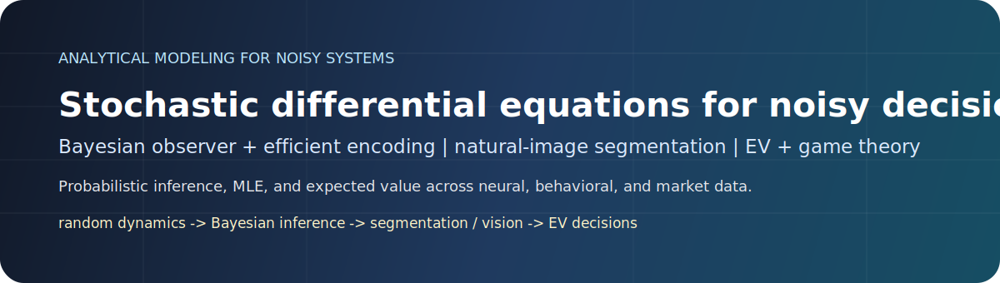
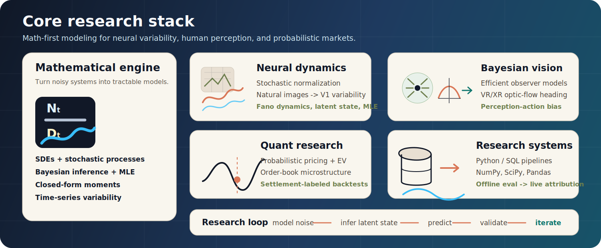
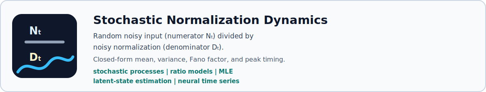
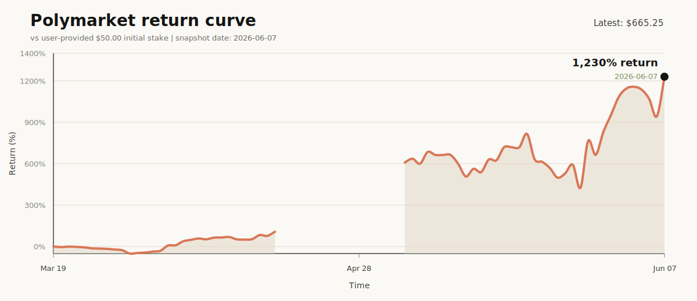

  

# Linghao Xu

I am a Ph.D. researcher in computational neuroscience in Dr. Ruben Coen-Cagli's lab at Albert Einstein College of Medicine. My earlier perception research was with Prof. Alan Stocker at the University of Pennsylvania.

My background is mathematics-heavy: stochastic-process modeling, Bayesian inference, efficient coding, closed-form moment derivations, maximum-likelihood estimation, and empirical validation on neural, behavioral, and market data.

The common thread is **quantitative problem decomposition**: turning hard, noisy questions into estimable pieces, choosing a probabilistic model, quantifying uncertainty, and validating whether the model actually explains the data.

My current research focus is **dynamic stochastic normalization**: how neural variability evolves when both the input drive and the normalization signal are random variables, and how to analytically infer not only variability but also its dynamics.

I also build open-source agent tooling for the same reason: complex work should end as something a person can read and a future agent can verify.

**Recent external open-source work:** PMXT merged two prediction-market SDK fixes ([#1064](https://github.com/pmxt-dev/pmxt/pull/1064), [#1065](https://github.com/pmxt-dev/pmxt/pull/1065)), and Filecoin Lotus merged a node-operator CLI/configuration warning fix ([#13670](https://github.com/filecoin-project/lotus/pull/13670)).

**Open/submitted PRs:** Polymarket CLI event defaults ([#83](https://github.com/Polymarket/polymarket-cli/pull/83)), cryptofeed market-data parser/auth-boundary fixes ([#1115](https://github.com/bmoscon/cryptofeed/pull/1115), [#1116](https://github.com/bmoscon/cryptofeed/pull/1116)), The Graph CLI validation ([#2141](https://github.com/graphprotocol/graph-tooling/pull/2141)), rust-bitcoin test-infrastructure path sharing ([#170](https://github.com/rust-bitcoin/bitcoind/pull/170)), and Lightning channel-policy API visibility ([#4731](https://github.com/lightningdevkit/rust-lightning/pull/4731)).

  Email: linghaoxu11 [at] gmail [dot] com |
  <a href="https://journals.plos.org/ploscompbiol/article?id=10.1371/journal.pcbi.1013147">PLOS Computational Biology</a> |
  <a href="https://pmc.ncbi.nlm.nih.gov/articles/PMC9652722/">Journal of Vision</a> |
  <a href="https://github.com/DeepCogNeural/bayesian-heading-observer">Observer code</a> |
  <a href="https://github.com/DeepCogNeural/sun-v1-segmentation-uncertainty">Public V1 code</a> |
  <a href="https://github.com/DeepCogNeural/html-artifact-report-skill">Agent report skill</a>

  

**Keywords:** stochastic differential equations, stochastic processes, stochastic normalization, Bayesian inference, neural variability, V1 dynamics, natural image segmentation, Bayesian observer models, efficient coding, optic flow, heading perception, VR/XR perception, perception-action bias, probabilistic pricing, expected value, market microstructure, settlement-labeled backtesting, agent skills, HTML artifacts, JSON manifests, MLE, time series.

**Tool kit:** Python, SQL, NumPy, SciPy, Pandas, HTML/CSS, JSON Schema.

## Selected work

### Dynamic Stochastic Divisive Normalization

  

**Summary:** I build analytical models for neural systems where both the signal and the normalization pool are noisy and time-varying.

**Highlight:** this is the core research thread behind my V1 work: dynamic stochastic equations for normalization-style models, closed-form variability predictions, and likelihood-based fitting to neural data.

My core research develops a dynamic stochastic normalization model for neural time series. The central problem is mathematically simple to state but difficult to solve: neural response is modeled as a ratio where both the numerator and the denominator are random, time-varying signals.

Rather than treating variability as simulation noise, I derive analytical predictions for response mean, variance, Fano-factor dynamics, and peak-variability timing. I then fit these dynamics to high-dimensional neural data with maximum-likelihood estimation.

My public V1 repository is a cleaned research-code view of a collaborative project connecting natural-image segmentation, posterior uncertainty, and early visual cortical dynamics. The part most aligned with my own contribution is not generic image segmentation; it is analytical modeling of neural dynamics and variability: posterior moments, firing-rate dynamics, Fano-factor decay, and how natural-image structure can organize response heterogeneity.

**Keywords:** stochastic processes, ratio of random variables, Gaussian-process modeling, closed-form moments, latent-state estimation, MLE, neural variability.

**Public code:** [sun-v1-segmentation-uncertainty](https://github.com/DeepCogNeural/sun-v1-segmentation-uncertainty)

### Bayesian observer models for visual perception

  

**Summary:** I model how humans infer heading direction from optic flow, and why the final action/report can be biased even when sensory inference is statistically efficient.

**Highlight:** this gives a production-relevant way to reason about VR/XR navigation: separate sensory encoding, Bayesian inference, memory, and perception-to-action mapping instead of treating user bias as an unexplained behavioral artifact.

I study human vision as an inference-and-action system. In optic-flow heading perception, humans do not simply report a sensory estimate; their responses reflect efficient sensory coding, Bayesian priors, and a mapping from perceptual estimates to action reports.

**Co-first author:** 2025 PLOS Computational Biology paper showing that response-range-dependent heading biases can be explained by an efficient Bayesian observer plus a linear perception-action mapping.

**First author:** 2022 Journal of Vision paper showing attractive serial dependence in heading perception from optic flow.

This line of work is directly relevant to VR/XR navigation and human-in-the-loop systems because it explains where behavioral bias enters: sensory encoding, prior integration, memory, or the final action/report stage. That matters for systems where a user must perceive self-motion, maintain heading, and turn perception into action under uncertainty.

**Links:** [Observer code](https://github.com/DeepCogNeural/bayesian-heading-observer) | [PLOS Computational Biology 2025](https://journals.plos.org/ploscompbiol/article?id=10.1371/journal.pcbi.1013147) | [Journal of Vision 2022](https://pmc.ncbi.nlm.nih.gov/articles/PMC9652722/)

### Open-source agent report systems

  

**Summary:** I build file-based agent tooling that turns notes or Markdown into a readable standalone HTML report plus an auditable JSON manifest.

**Highlight:** the design separates two jobs that often get mixed together: HTML is the reading surface for people; JSON is the structured interface for future agents, automation, diffing, and verification.

The project packages this as an open-source agent skill with a public contract, golden examples, schema validation, and checker-enforced alignment between visible HTML sections/components and JSON manifest IDs. It is meant for substantial agent outputs where chat or a Markdown wall is not enough: decision briefs, research reports, technical reviews, incident writeups, strategy memos, and data-heavy summaries.

The engineering idea is the same as my research work: define the contract, keep the latent structure explicit, and verify that the output still matches the evidence instead of trusting a polished surface.

**Public code:** [html-artifact-report-skill](https://github.com/DeepCogNeural/html-artifact-report-skill)

### Research-to-market probabilistic pricing

  

**Summary:** I treat prediction-market contracts as probabilistic pricing problems, not simple forecasting bets.

**Highlight:** this is my research-to-production loop: find market alpha, test it with final-settlement labels, measure execution quality, and feed fills, misses, and realized outcomes back into the next research cycle.

Built a research-driven trading framework for Polymarket weather markets, treating each contract as a probabilistic pricing and execution problem. The system studies event-probability mispricings from weather observation lag, order-book repricing, and microstructure behavior; validates hypotheses with final-settlement-labeled backtests; and uses post-trade attribution to analyze expected value, execution quality, missed fills, and realized outcomes.

This is the same research loop I use in science: define the latent variable, identify the source of noise, build a measurable model, backtest against final labels, and use failures as data for the next iteration. The live pilot is intentionally small-capital, which makes capital efficiency and execution attribution more informative than raw dollar P&L.

  

**Public-safe snapshot:** return is measured against the user-provided $50 initial stake; the current public snapshot date is 2026-06-07 UTC. Source account data refreshes every 15 minutes, but this public GitHub image updates only when the generator is rerun and pushed. The JSON keeps only rounded date-level returns. [Sanitized metrics JSON](assets/polymarket-performance.json)

## Research profile

| Area | What I work on |
| --- | --- |
| Quantitative problem decomposition | Break hard signal, behavior, and market questions into latent variables, uncertainty estimates, validation protocols, and decision rules |
| Mathematical modeling | Stochastic processes, ratio distributions, closed-form moment derivations, optimization, MLE |
| Neural dynamics | Divisive normalization, latent-state estimation, Fano-factor dynamics, non-stationary neural time series |
| Vision and VR/XR perception | Bayesian observer models, optic flow, heading perception, perception-action bias, serial dependence |
| Research systems | Python, NumPy/SciPy/Pandas, SQL/SQLite, Parquet, REST/WebSocket data collection, offline evaluation |
| Agent tooling | HTML artifact reports, JSON manifests, schema validation, golden examples, CI checkers |
| Quant research | Digging alpha, probabilistic pricing, expected value, market microstructure, settlement-labeled backtests |
| Research to production | Data pipelines, offline evaluation, live pilots, execution attribution, failure-analysis loops |

## What I am looking for

I am looking for internships on two tracks.

**Quant research / trading:** roles where I can dig alpha from noisy market data, turn hypotheses into probabilistic signals, backtest against final labels, and improve decision quality through execution and risk analysis.

**Tech research / applied science:** roles in vision, VR/XR perception, neural dynamics, and uncertainty-aware decision systems where mathematical modeling and end-to-end research systems both matter.

Across both tracks, my strongest fit is work that rewards general mathematical modeling ability: turning hard, noisy questions into latent variables, uncertainty estimates, expected values, readable artifacts, and evaluation loops that hold up under validation.
