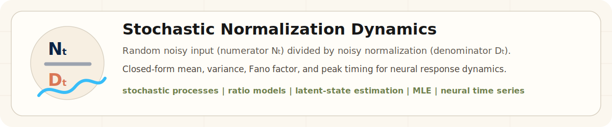
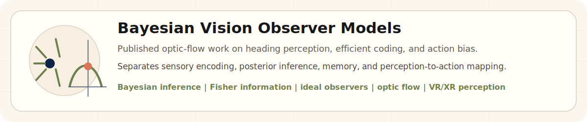
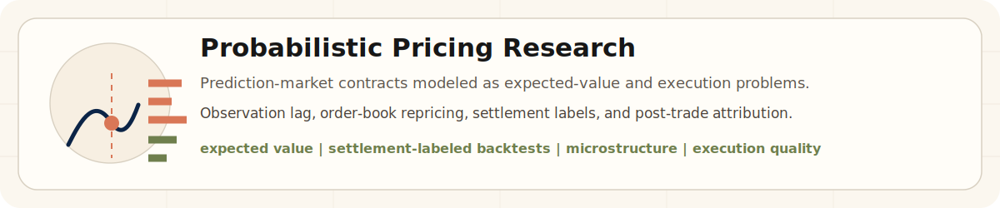

  

# Linghao Xu

I am a Ph.D. researcher in computational neuroscience with a mathematics background, building analytical probabilistic models for neural variability, visual perception, and decision systems.

My strongest work is turning noisy, dynamic systems into tractable models: stochastic-process modeling, Bayesian inference, efficient coding, closed-form moment derivations, maximum-likelihood estimation, and empirical validation on neural, behavioral, and market data.

**Current focus:** dynamic stochastic normalization - how neural variability evolves when both the input drive and the normalization signal are random variables.

  <a href="mailto:linghaoxu11@gmail.com">Email</a> |
  <a href="https://journals.plos.org/ploscompbiol/article?id=10.1371/journal.pcbi.1013147">PLOS Computational Biology</a> |
  <a href="https://pmc.ncbi.nlm.nih.gov/articles/PMC9652722/">Journal of Vision</a> |
  <a href="https://github.com/DeepCogNeural/sun-v1-segmentation-uncertainty">Public V1 code</a>

## Selected work

  

  

  

### Dynamic Stochastic Divisive Normalization

My core research develops a dynamic stochastic normalization model for neural time series. The central problem is mathematically simple to state but difficult to solve: neural response is modeled as a ratio where both the numerator and the denominator are random, time-varying signals.

Rather than treating variability as simulation noise, I derive analytical predictions for response mean, variance, Fano-factor dynamics, and peak-variability timing. I then fit these dynamics to high-dimensional neural data with maximum-likelihood estimation.

**Keywords:** stochastic processes, ratio of random variables, Gaussian-process modeling, closed-form moments, latent-state estimation, MLE, neural variability.

### Bayesian observer models for visual perception

I also study human vision as an inference-and-action system. In optic-flow heading perception, humans do not simply report a sensory estimate; their responses reflect efficient sensory coding, Bayesian priors, and a mapping from perceptual estimates to action reports.

I am co-first author on a 2025 PLOS Computational Biology paper showing that response-range-dependent heading biases can be explained by an efficient Bayesian observer plus a linear perception-action mapping. I am first author on a 2022 Journal of Vision paper showing attractive serial dependence in heading perception from optic flow.

This line of work is directly relevant to navigation, VR/XR, and human-in-the-loop systems because it explains where behavioral bias enters: sensory encoding, prior integration, memory, or the final action/report stage.

**Links:** [PLOS Computational Biology 2025](https://journals.plos.org/ploscompbiol/article?id=10.1371/journal.pcbi.1013147) | [Journal of Vision 2022](https://pmc.ncbi.nlm.nih.gov/articles/PMC9652722/)

### Research-to-market probabilistic pricing

Built a research-driven trading framework for Polymarket weather markets, treating each contract as a probabilistic pricing and execution problem. The system studies event-probability mispricings from weather observation lag, order-book repricing, and microstructure behavior; validates hypotheses with final-settlement-labeled backtests; and uses post-trade attribution to analyze expected value, execution quality, missed fills, and realized outcomes.

This is the same research loop I use in science: define the latent variable, identify the source of noise, build a measurable model, backtest against final labels, and use failures as data for the next iteration.

## Public code and collaborative V1 project

My public V1 repository is a cleaned research-code view of a collaborative project connecting natural-image segmentation, posterior uncertainty, and early visual cortical dynamics.

For this project, the part most aligned with my own research contribution is not generic image segmentation; it is the analytical modeling of neural dynamics and variability: posterior moments, firing-rate dynamics, Fano-factor decay, and how natural-image structure can organize response heterogeneity.

**Link:** [sun-v1-segmentation-uncertainty](https://github.com/DeepCogNeural/sun-v1-segmentation-uncertainty)

## Research profile

| Area | What I work on |
| --- | --- |
| Mathematical modeling | Stochastic processes, ratio distributions, closed-form moment derivations, optimization, MLE |
| Neural dynamics | Divisive normalization, latent-state estimation, Fano-factor dynamics, non-stationary neural time series |
| Vision perception | Bayesian observer models, optic flow, heading perception, serial dependence, efficient coding |
| Research systems | Python, NumPy/SciPy/Pandas, SQL/SQLite, Parquet, REST/WebSocket data collection, offline evaluation |
| Quant research | Probabilistic pricing, expected value, market microstructure, settlement-labeled backtests, execution attribution |

## What I am looking for

I am primarily interested in quant research and quant trading roles where rigorous modeling, data infrastructure, and decision quality matter: prediction markets, market microstructure, systematic signals, execution analysis, and risk-aware research-to-production loops.

I am also interested in research teams working on vision, perception, neural dynamics, VR/XR, and uncertainty-aware decision systems.
