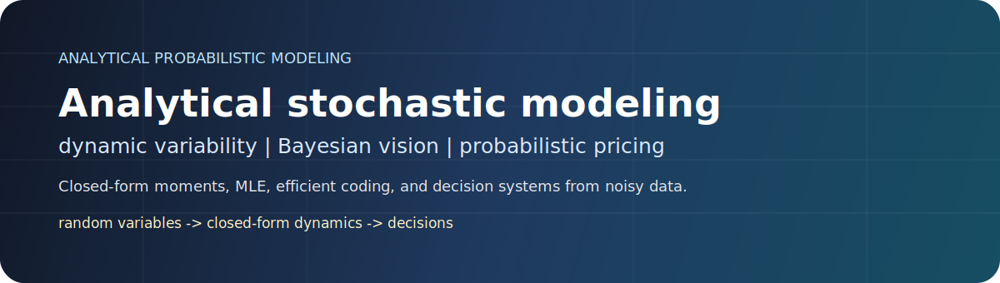
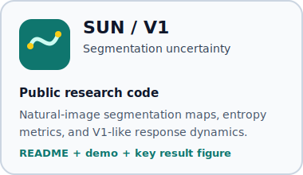
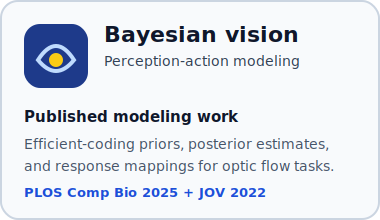
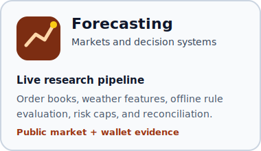

  

# Linghao Xu

I am a Ph.D. researcher in computational neuroscience building probabilistic models and research systems for problems where perception, uncertainty, and decisions interact. My work spans V1 neural dynamics, Bayesian perception-action modeling, large-scale experimental pipelines, and statistical forecasting systems.

**Current focus:** uncertainty-aware models for visual inference, neural response dynamics, and decision policies that can be evaluated against real data.

  <a href="mailto:linghaoxu11@gmail.com">Email</a> |
  <a href="https://github.com/DeepCogNeural/sun-v1-segmentation-uncertainty">SUN V1 project</a> |
  <a href="https://journals.plos.org/ploscompbiol/article?id=10.1371/journal.pcbi.1013147">PLOS Computational Biology</a> |
  <a href="https://pmc.ncbi.nlm.nih.gov/articles/PMC9652722/">Journal of Vision</a> |
  <a href="https://polymarket.com/0x75CCCAceD848ab3BD789057327E293E56B176B15">Forecasting track record</a>

## Selected work

<table>
  <tr>
    <td width="33%">
      
    </td>
    <td width="33%">
      
    </td>
    <td width="33%">
      
    </td>
  </tr>
</table>

### SUN: segmentation uncertainty for V1 dynamics

Public research code for studying how uncertainty in natural-image segmentation can generate V1-like firing-rate and variability dynamics. The repository includes a readable project overview, a no-private-data demo, module documentation, and a key result figure.

**Link:** [sun-v1-segmentation-uncertainty](https://github.com/DeepCogNeural/sun-v1-segmentation-uncertainty)

### Bayesian perception-action modeling

Co-first author on a PLOS Computational Biology paper modeling how response-range constraints shape heading estimates from optic flow.\n
First author on a Journal of Vision paper on attractive serial dependence in heading perception.

**Links:** [PLOS Computational Biology 2025](https://journals.plos.org/ploscompbiol/article?id=10.1371/journal.pcbi.1013147) | [Journal of Vision 2022](https://pmc.ncbi.nlm.nih.gov/articles/PMC9652722/)

### Forecasting and decision systems

Built a live research pipeline for weather prediction markets: order-book snapshots, weather-provider features, offline rule evaluation, risk caps, monitored execution, and reconciliation. Public evidence is linked through market and wallet activity; implementation details remain private.

**Links:** [Polymarket activity](https://polymarket.com/0x75CCCAceD848ab3BD789057327E293E56B176B15) | [Wallet activity](https://polygonscan.com/address/0x75cccaced848ab3bd789057327e293e56b176b15#tokentxns)

## Research profile

| Area | What I work on |
| --- | --- |
| Probabilistic modeling | Bayesian inference, latent-state estimation, Monte Carlo reasoning, MLE, uncertainty metrics |
| Computational neuroscience | V1 dynamics, firing-rate and Fano-factor modeling, stochastic normalization, neural time series |
| Perception and action | Optic flow, heading perception, efficient coding, response mapping, psychophysics |
| Research systems | Python data pipelines, SQL/SQLite, Parquet, REST/WebSocket data collection, offline evaluation |
| Quantitative decision-making | Forecasting markets, feature engineering, order-book analysis, risk-controlled live pilots |

## What I am looking for

I am interested in research internships and collaborations where the core problem is measurable uncertainty: perception systems, neural or behavioral modeling, control policies, market/forecasting systems, and rigorous evaluation pipelines.

If a project needs both mathematical modeling and end-to-end empirical infrastructure, that is the kind of work I like doing.
